# 📦 Inventory Management Web App (MERN Stack)

<br/>

## 🚀 Project Overview
This is a full-stack inventory management web application built using the MERN stack — MongoDB, Express.js, React, and Node.js. Designed to help users track and manage inventory with ease, the app supports adding new items, updating stock levels, and viewing item details through a clean and intuitive interface.

<br/>

## 🛠️ Tech Stack
- HTML/Tailwind CSS
- React
- Redux
- MongoDb
- Mode, Express and Mongoose

<br/>

### 🧠 What I Learned
1. Full-Stack Architecture in Practice
- I gained hands-on experience in building a complete web app from scratch, integrating frontend and backend seamlessly.
- Learned how to structure a scalable codebase that separates concerns between client and server.
2. React for Dynamic UI
- Built a responsive and user-friendly interface using React.
- Mastered state management and component lifecycle to ensure smooth user interactions.
- Applied conditional rendering and form handling.
3. Express & Node.js for Backend Logic
- Developed RESTful APIs to handle CRUD operations for inventory items.
- Implemented middleware for request validation and error handling.
- Strengthened my understanding of asynchronous operations and routing.
4. MongoDB for Data Persistence
- Designed flexible schemas to store inventory data efficiently.
- Used Mongoose for data modeling and validation.
- Learned how to handle database operations securely and optimize queries.
5. Authentication & Security
- Implemented basic user authentication and protected routes.
- Learned best practices for securing API endpoints and managing user sessions.
6. Performance & Optimization
- Explored techniques to reduce re-renders and improve data fetching.
- Practiced debugging and profiling to identify bottlenecks in both frontend and backend.
7. Deployment & DevOps
- Deployed the app using services like Render and connected it to a cloud-hosted MongoDB instance.
- Learned how to manage environment variables and configure build scripts.

<br/>

## 🌱 Personal Growth
This project was more than just code — it was a deep dive into the world of full-stack development. It challenged me to think holistically, solve real-world problems, and polish my skills across the stack. I now feel more confident in building production-ready applications and collaborating on larger projects.

<br/>

## 🛠️ Installation Guide
Follow these steps to set up and run the project locally:

### step 1: Clone the Frontend Repository and Install Dependencies
```
git clone https://github.com/smshiplu/inventory-manager-frontend-mern.git
cd inventory-manager-frontend-mern
npm install
```

### Step 2: Clone the Backend Repository and Install Dependency
```
git clone https://github.com/smshiplu/inventory-manager-backend-mern.git
cd inventory-manager-backend-mern
npm install
```

### Step 3: Set Up Environment Variables
Create a .env file in the server directory and add the following:
```
REACT_APP_BACKEND_URL=http://localhost:8000
REACT_APP_GUEST_LOGIN_EMAIL=shiplu@example.com 
REACT_APP_GUEST_LOGIN_PASSWORD=random
NODE_ENV=development
```


**NOTE:** Replace your_mongodb_connection_string and your_jwt_secret_key with your actual credentials to use it online

### Step 4: Run the App
```
# Start Backend Server
cd inventory-manager-backend-mern
npm run start

# Start Frontend
cd inventory-manager-frontend-mern
npm start
```

**NOTE:** The app will be available at `http://localhost:3000` and the backend will run on `http://localhost:8000`.


<br/>

## 🧪 Testing
To ensure the app works as expected, follow these testing steps:
✅ Manual Testing
- Start the backend and frontend servers as described in the installation guide.
- Open `http://localhost:3000` in your browser.
- Test the following user flows:
- Add Item: Fill out the form to add a new inventory item. Confirm it appears in the list.
- Update Stock: Modify the quantity of an existing item and check if the change reflects.
- Delete Item: Remove an item and verify it disappears from the list.
- Update Profile: Update user profile information.
- Change Password: Change the login password.
- Authentication: Register and log in with a test account. Try accessing protected routes.

<br/>

## 🧪 API Testing (Optional)
Use tools like Postman or Insomnia to test backend endpoints:

### Product API endpoint
- POST /api/products → Add new item
- GET /api/products → Fetch all items
- GET /api/products/:id → Fetch single items
- PUT /api/products/:id → Update item
- DELETE /api/products/:id → Delete item

### Authentication API endpoint
- POST /api/users/login → User login
- GET /api/users/loginStatus → Get login status
- GET /api/users/getUser → Get user profile
- GET /api/users/logout → User Logout
- POST /api/users/register → Register new user
- PATCH /api/users/updateUser → Update user
- PATCH /api/users/updatePassword → Update user password
- POST /api/users/forgetPassword → Forget password
- PUT /api/users/resetPassword/{token} → Reset password

### Contact API endpoint
- POST /api/contactUs → Contact us

<br/>

## 📸 Screenshot##

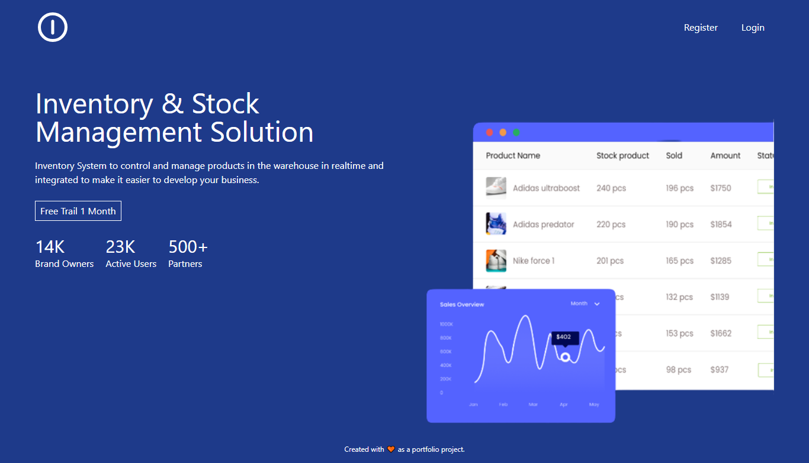
---
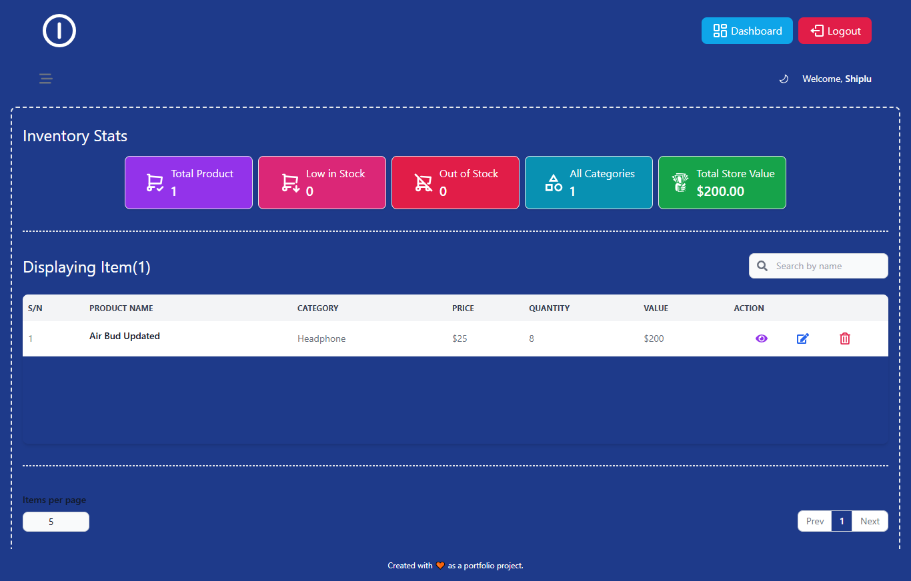
---
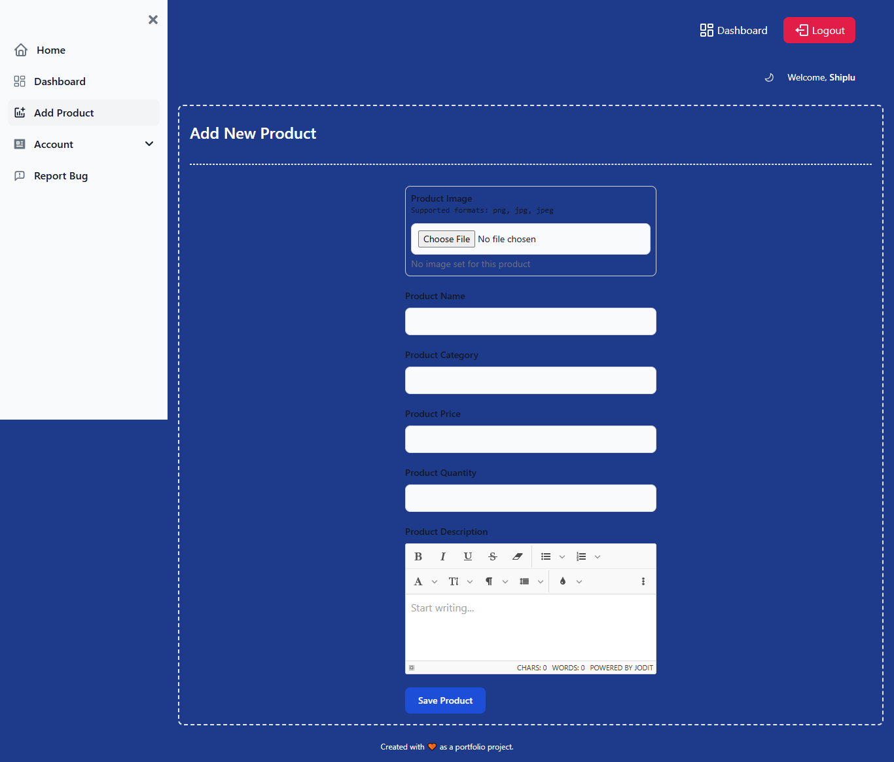
---
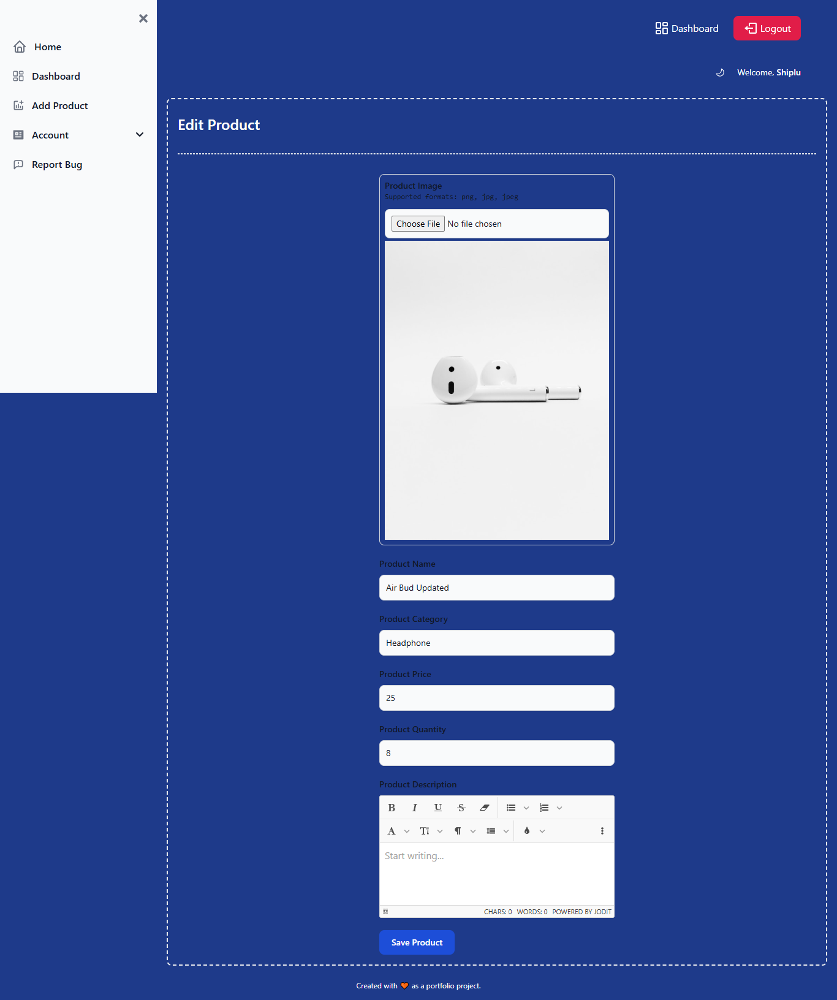
---
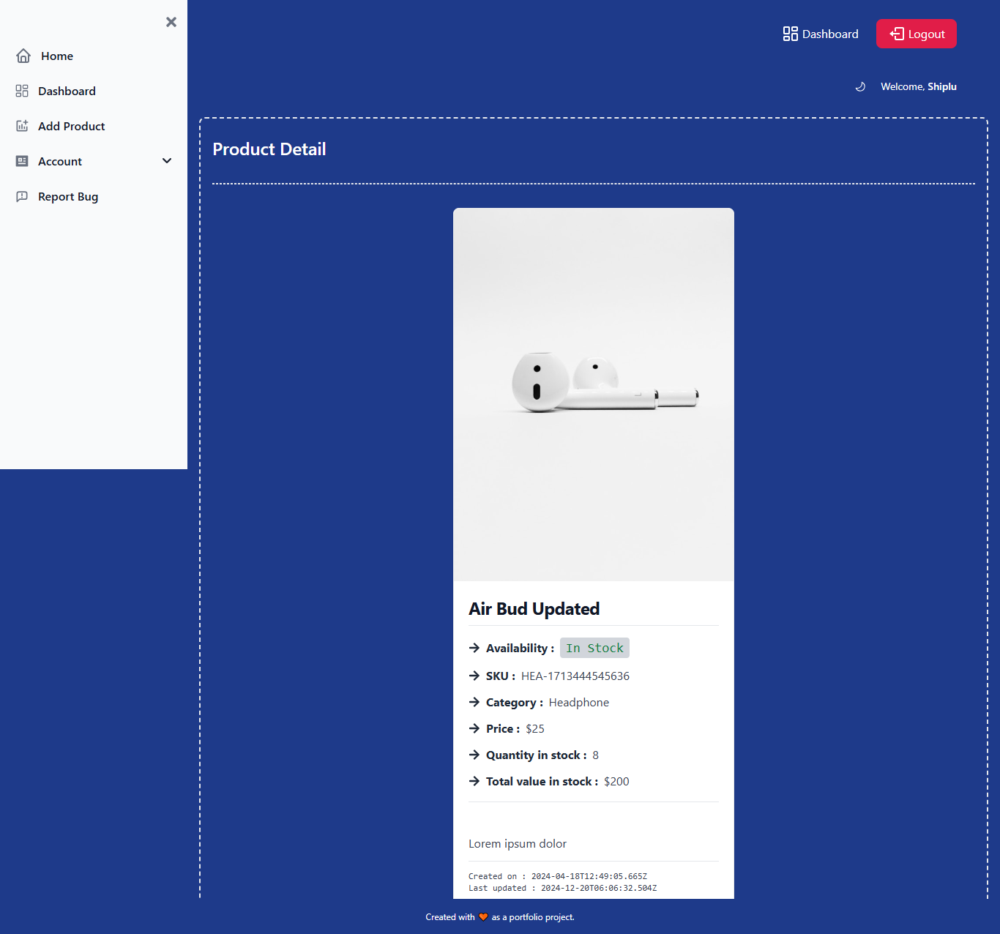
---
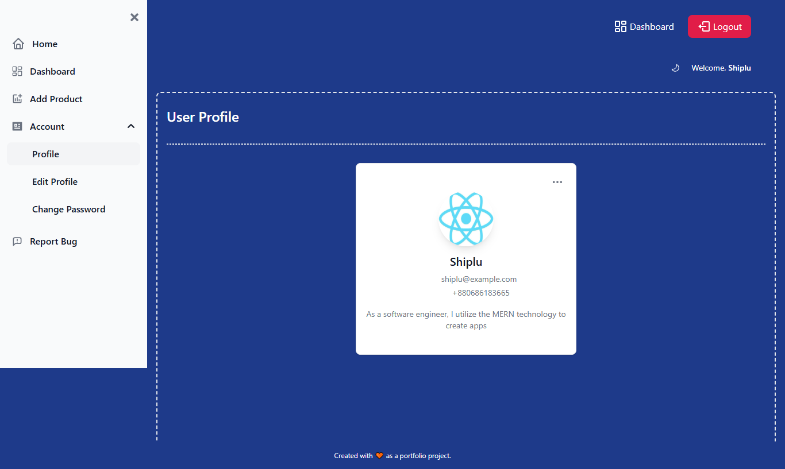
---
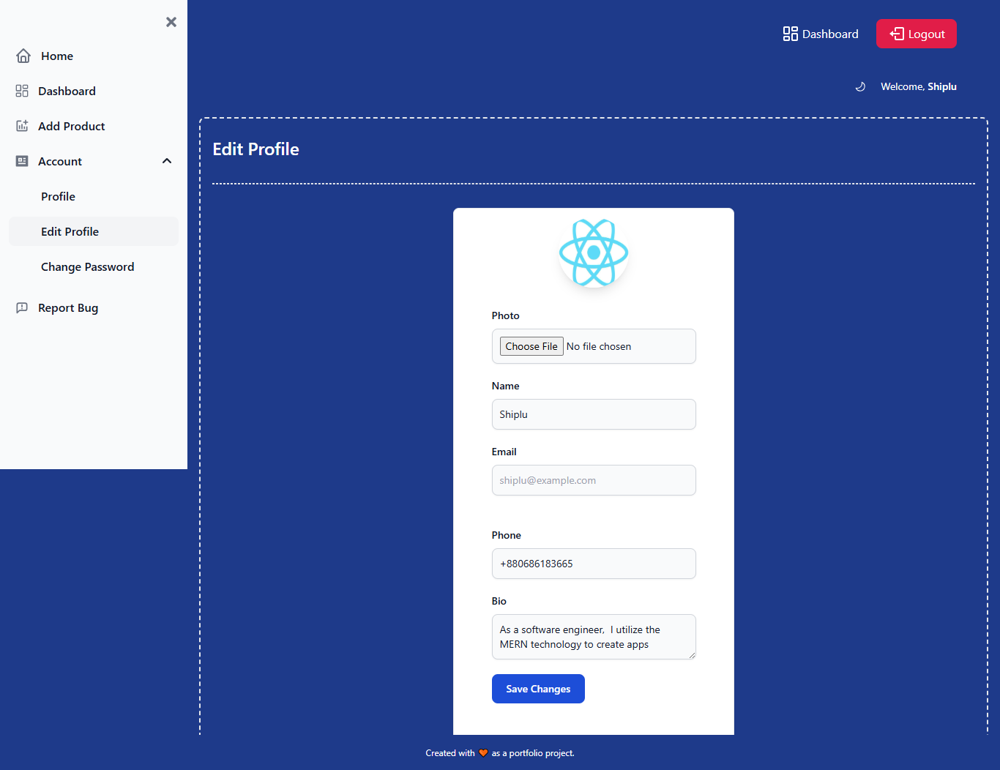
---
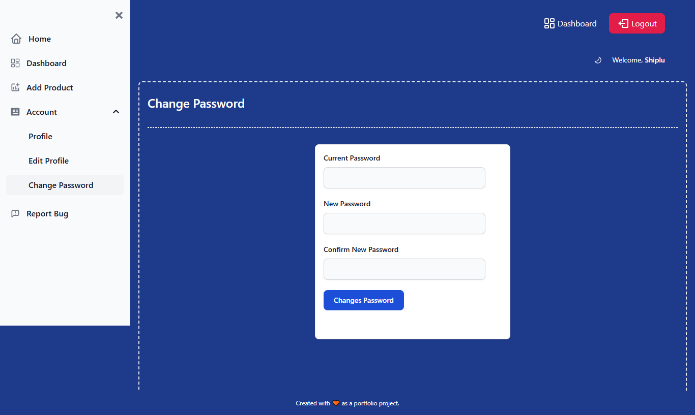
---
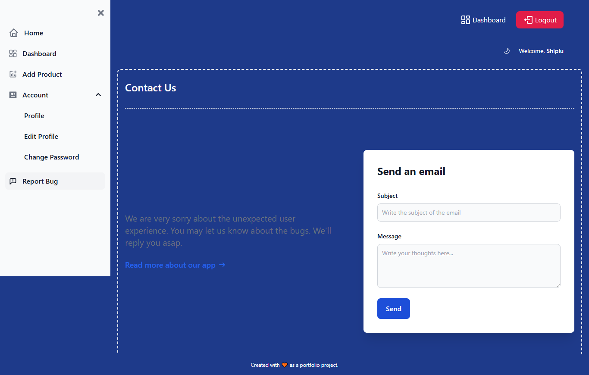
---
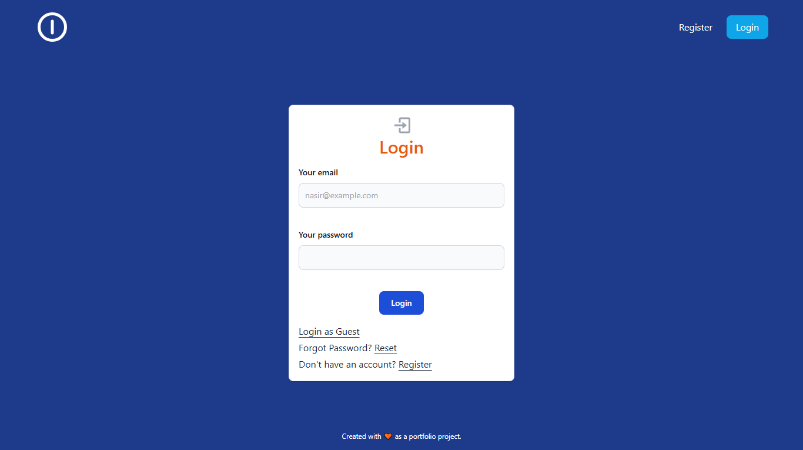
---
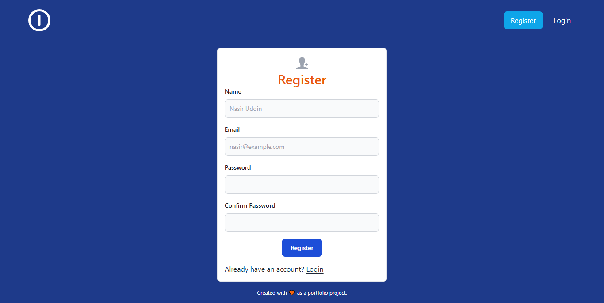
---
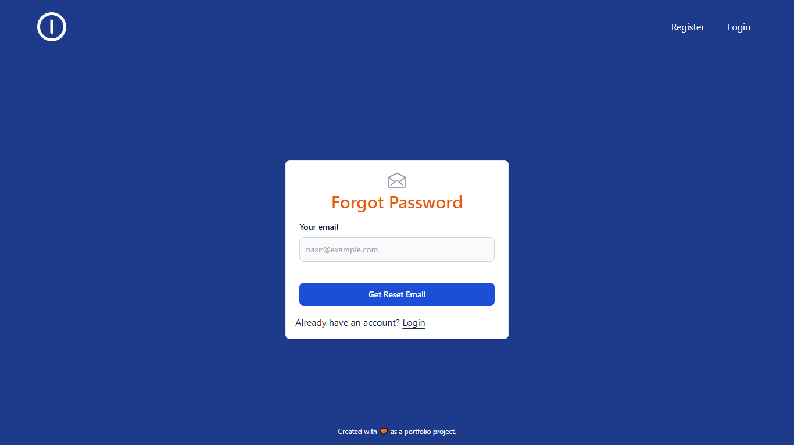
---